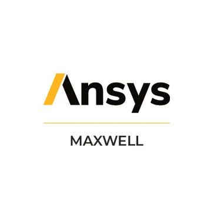
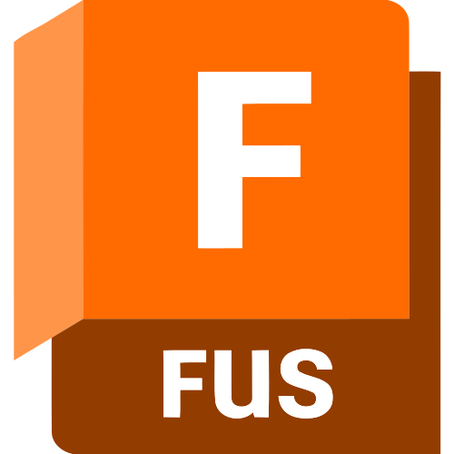

# 👋 Hallo, I'm Calvin Yang :P

### 💻 Computer Science & Engineering @ UC Irvine
### ⚡ Engineering Enthusiast • Content Creator • Gamer

  

---

# 🚀 About Me

🎓 Incoming **Computer Science & Engineering** student at **UC Irvine**

💻 Interested in

- 💻 Software Engineering
- 🌌 Universe
- ⚡ Embedded Systems
- 🧲 Electromagnetics
- 🎨 Computer Graphics
- 🎮 Game Development

⚡ Currently

- 🌱 Learning **C, Java, Data Structures & Algorithms**
- 🔬 Exploring **ESP32** to replace Arduino
- 🛠 Building personal programming projects
- 📹 Creating gaming content on YouTube

---

# 💻 Languages

---

# 🛠 Tools

### Development

### Engineering & Design

&nbsp;

&nbsp;

&nbsp;

&nbsp;

---

# 📊 GitHub Stats

  

---

# 🎯 Goals for 2026

- 🚀 Master **ESP32** so I can upgrade my coil gun :D
- 🤝 Connect with more people and make more friends!
- 🔧 Reach **100k subscribers** on my YouTube channel
- 🏁 Join engineering project teams at UCI
- 💼 Apply for internships and prepare for undergraduate research

---

### ⭐ Thanks for visiting!

*"The best way to learn is to build."* 🚀

